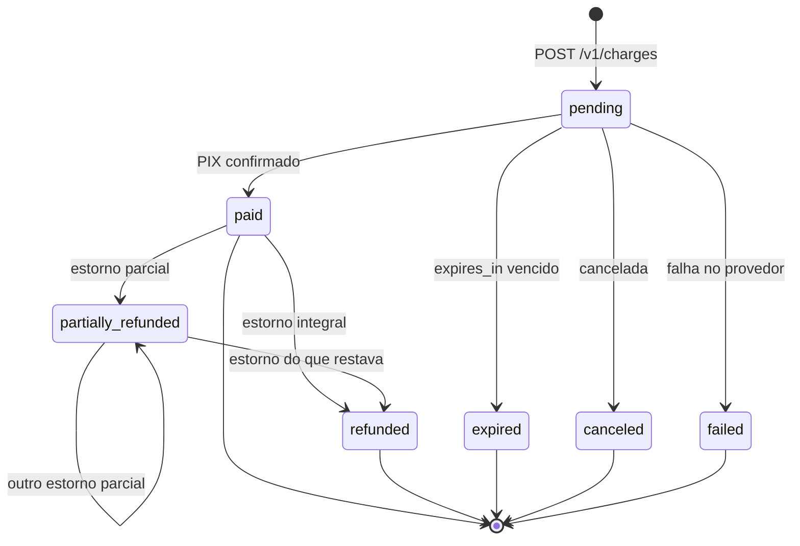

import TabelaStatusCobranca from "/snippets/tabela-status-cobranca.mdx";
import Suporte from "/snippets/suporte.mdx";

Uma cobrança nasce `pending` e caminha para um estado do qual não volta.

<TabelaStatusCobranca />

## `partially_refunded` é estado próprio

Uma venda devolvida pela metade fica `partially_refunded`, e não `refunded`.

A distinção existe porque tratar as duas como a mesma coisa faria o seu relatório descontar o valor
inteiro de uma venda que só voltou pela metade. O quanto voltou está em `refunded_amount`, acumulado
entre estornos parciais; o que ainda cabe estornar é `amount - refunded_amount`.

## Expiração

`expires_in` é a validade do QR, em segundos.

| | Valor |
| --- | --- |
| Padrão | 3.600 s (1 hora) |
| Mínimo | 60 s |
| Máximo | 604.800 s (7 dias) |

O piso de 60 s evita uma cobrança que expira antes de o comprador abrir o aplicativo do banco. O
horário exato do vencimento volta em `pix.expires_at`.

Uma cobrança `expired` não pode ser paga nem estornada. Para tentar de novo, crie outra — com uma
`Idempotency-Key` nova, já que é uma tentativa nova de verdade.

## Em qual estado agir

<Warning>
  O momento de liberar o produto é o `charge.paid`, não a resposta de `POST /v1/charges`. A criação
  devolve `pending` — o QR já existe, mas o pagamento ainda não aconteceu.
</Warning>

As datas contam a história e vêm `null` até acontecerem: `created_at`, `paid_at`, `expired_at`,
`refunded_at`.

## Veja também

<CardGroup cols={2}>
  <Card title="Checkout PIX" icon="qr-code" href="/receitas/checkout-pix">
    O fluxo inteiro, da criação à liberação do produto.
  </Card>
  <Card title="Estornos" icon="rotate-ccw" href="/essenciais/estornos">
    O que acontece depois de `paid`.
  </Card>
</CardGroup>

<Suporte />
