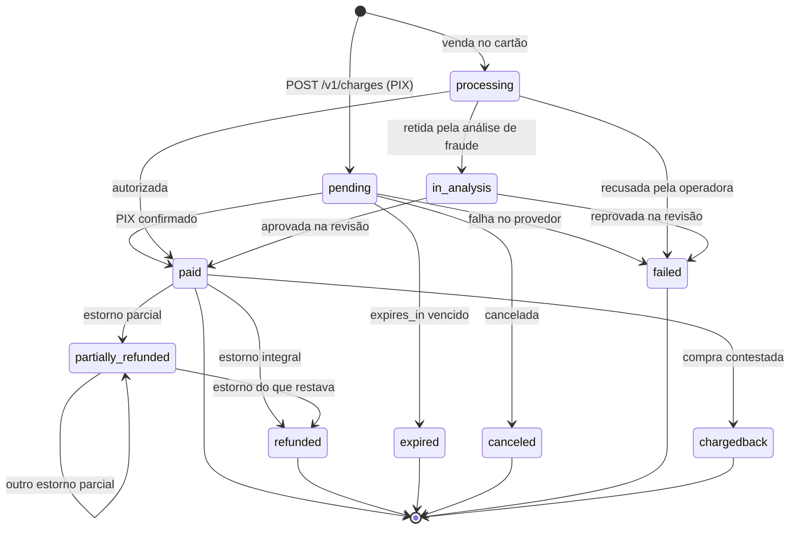

import TabelaStatusCobranca from "/snippets/tabela-status-cobranca.mdx";
import Suporte from "/snippets/suporte.mdx";

Uma cobrança caminha para um estado do qual não volta. Onde ela começa depende do meio de pagamento:
o PIX nasce `pending`, o cartão nasce `processing`.

<TabelaStatusCobranca />

## Só três estados ainda mudam sozinhos

`pending`, `processing` e `in_analysis` são os estados de trânsito: a cobrança ainda vai se mexer
sem que ninguém peça. Os demais são terminais, com a exceção de `paid` e `partially_refunded`, que
seguem admitindo estorno.

`processing` e `in_analysis` são do cartão. A autorização é decidida na mesma requisição, mas pode
parar na análise de fraude antes de virar `paid` ou `failed` — e a revisão leva horas. No PIX não há
etapa intermediária: a cobrança vai direto de `pending` para o desfecho.

`in_analysis` não é um `paid` mais lento: a revisão pode terminar em recusa. O desfecho chega como
`charge.paid` ou `charge.failed`, e é nele que você age.

Uma recusa da operadora tem uma particularidade que vale guardar: ela responde `402` e **cria** a
cobrança, já em `failed`. Ver [Cobrança no cartão](/essenciais/cartao).

## `partially_refunded` é estado próprio

Uma venda devolvida pela metade fica `partially_refunded`, e não `refunded`.

A distinção existe porque tratar as duas como a mesma coisa faria o seu relatório descontar o valor
inteiro de uma venda que só voltou pela metade. O quanto voltou está em `refunded_amount`, acumulado
entre estornos parciais; o que ainda cabe estornar é `amount - refunded_amount`.

## `chargedback` é o fim da linha

O portador contestou a compra na operadora e a bandeira levou o valor de volta. A cobrança fica
`chargedback` e não admite mais cancelamento nem estorno — não há o que devolver, o dinheiro já
saiu.

O débito no saldo do vendedor já aconteceu quando o evento chega, e vem descrito num objeto `refund`,
do mesmo jeito que num estorno. Se você já entregou o produto, é aqui que revoga o acesso. O aviso
chega como [`charge.chargedback`](/api-reference/webhooks/charge-chargedback).

## Expiração

`expires_in` é a validade do QR, em segundos.

| | Valor |
| --- | --- |
| Padrão | 86.400 s (24 horas) |
| Mínimo | 60 s |
| Máximo | 604.800 s (7 dias) |

O piso de 60 s evita uma cobrança que expira antes de o comprador abrir o aplicativo do banco. O
horário exato do vencimento volta em `pix.expires_at`.

Uma cobrança `expired` não pode ser paga nem estornada. Para tentar de novo, crie outra — com uma
`Idempotency-Key` nova, já que é uma tentativa nova de verdade.

## Em qual estado agir

<Warning>
  O momento de liberar o produto é o `charge.paid`, e nenhum outro. A criação devolve `pending` — o
  QR já existe, mas o pagamento ainda não aconteceu. E `in_analysis` é uma compra sob suspeita, que
  ainda pode ser recusada.
</Warning>

As datas contam a história e vêm `null` até acontecerem: `created_at`, `paid_at`, `expired_at`,
`refunded_at`.

## Veja também

<CardGroup cols={2}>
  <Card title="Checkout PIX" icon="qr-code" href="/receitas/checkout-pix">
    O fluxo inteiro, da criação à liberação do produto.
  </Card>
  <Card title="Checkout no cartão" icon="credit-card" href="/receitas/checkout-cartao">
    Onde `processing` e `in_analysis` aparecem na prática.
  </Card>
  <Card title="Estornos" icon="rotate-ccw" href="/essenciais/estornos">
    O que acontece depois de `paid`.
  </Card>
</CardGroup>

<Suporte />
